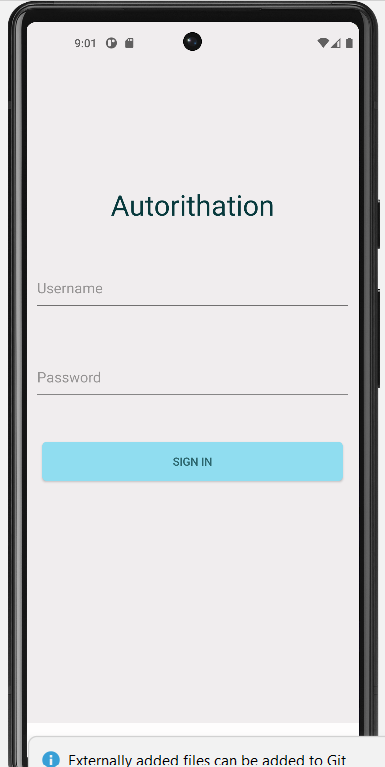
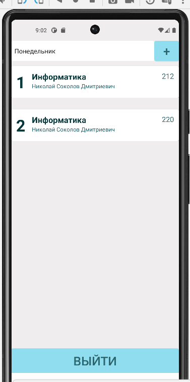
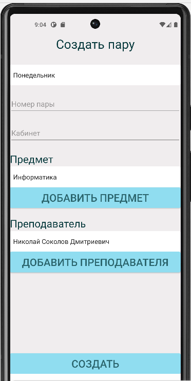
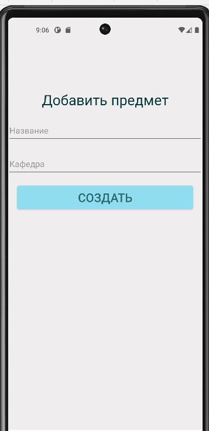

# Schedule
__Schedule__ - индивидуалный учебный проект. Это андроид приложение для составления расписания учебных занятий. 

## Технологии
* Java
* MS SQL
* XML

## Скриншоты проекта

## Возможности
* Добавление предмета, преподавателя и создание пары в MS SQL
* Удаление пары из MS SQL
* Выбор дня недели 

## Комментарии
Приесоединение к базе данных реализовывается в классе DBConection. В проекте не осуществлено добавление пользователя. В репозитории есть файл с SQL запросами создания БД, которая создается в MS SQL. Подключение происходит по локальной сети(т.е. должно быть подключение к интернету). Если терминал выдает ошибку советую посмотреть [это видео](https://www.youtube.com/watch?v=w6OAOViHAUE).
